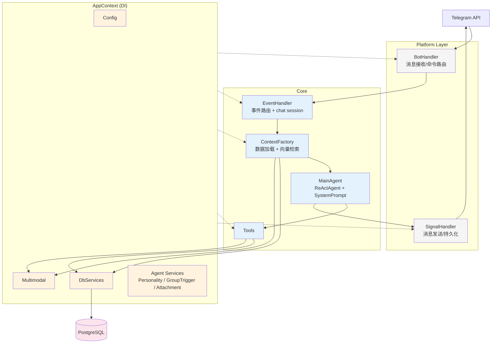

# hai 架构



## 事件流

```
Telegram → BotHandler → EventHandler → ContextFactory → MainAgent → SignalHandler → Telegram
```

多 chat 并行，单 chat 串行。

## Context 渲染顺序

`<situation>` → `<environment>` → `<chat>` → `<accounts>` → `<related_memories>` → `<related_topics>` → `<current_topics>` → `<scratchpad>` → `<perceptions>` → `<conversation>`

## System Prompt 叠加

`personality_context()` → scene → `TOOL_MANUAL` → user `system_prompt` → Skills

## 层次依赖

`entity → vo → repo → service → agent → app/context.rs`，`infra` 不依赖上层。
