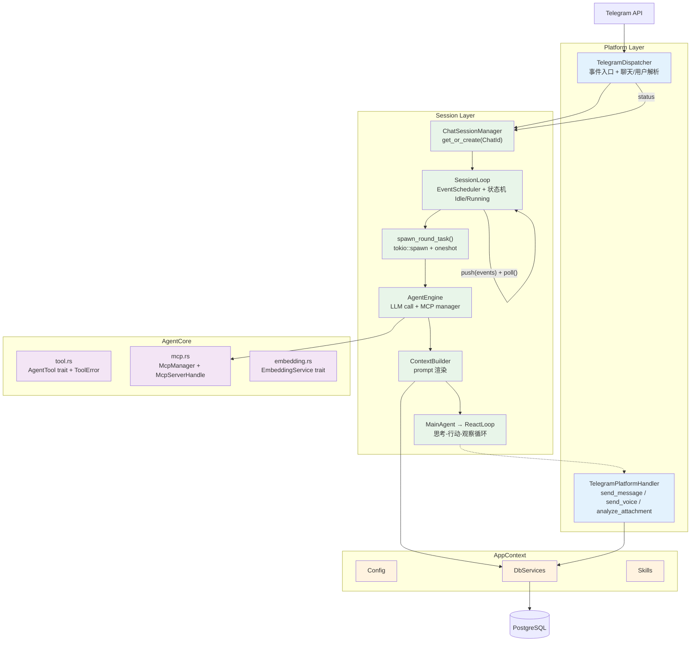

# hai 架构


```mermaid
graph TB
  TG["Telegram API"]

  subgraph Platform["Platform Layer"]
    DP["TelegramDispatcher<br/>事件入口 + 聊天/用户解析"]
    TH["TelegramPlatformHandler<br/>send_message / send_voice / analyze_attachment"]
  end

  subgraph Session["Session Layer"]
    SM["ChatSessionManager<br/>get_or_create(ChatId)"]
    SL["SessionLoop<br/>EventScheduler + 状态机 Idle/Running"]
    RN["spawn_round_task()<br/>tokio::spawn + oneshot"]
    EN["AgentEngine<br/>LLM call + MCP manager"]
    CTX["ContextBuilder<br/>prompt 渲染"]
    AG["MainAgent → ReactLoop<br/>思考-行动-观察循环"]
  end

  subgraph Core["AgentCore"]
    TL["tool.rs<br/>AgentTool trait + ToolError"]
    MC["mcp.rs<br/>McpManager + McpServerHandle"]
    EM["embedding.rs<br/>EmbeddingService trait"]
  end

  subgraph App["AppContext"]
    CFG["Config"]
    SRV["DbServices"]
    SK["Skills"]
  end

  PG[("PostgreSQL")]

  TG --> DP
  DP --> SM --> SL
  SL --> RN --> EN
  EN --> CTX --> AG
  EN --> MC
  AG -.-> TH

  SL -- push(events) + poll() --> SL

  DP -- status --> SM

  CTX --> SRV
  TH --> SRV
  SRV --> PG

  classDef platform fill:#e3f2fd
  classDef session fill:#e8f5e9
  classDef core fill:#f3e5f5
  classDef app fill:#fff3e0

  class DP,TH platform
  class SM,SL,RN,EN,CTX,AG session
  class TL,MC,EM core
  class CFG,SRV,SK app
```

## 核心抽象

| 类型 | 职责 | 通信方式 |
|------|------|---------|
| `ChatSessionManager` | `get_or_create(ChatId)` → `ChatSessionHandle`，内部 `mpsc` 实时清理僵尸 session | tokio `Arc<RwLock<HashMap>>` + background task |
| `ChatSessionHandle` | wake/status 操作的 proxy | tokio `mpsc::UnboundedSender` × 2 |
| `SessionLoop` | 单 chat 事件调度 + round 状态机 | `select!` 轮询 wake/status/result |
| `RunningRound` | 一轮 in-flight 的 `JoinHandle` + `oneshot::Receiver` | `poll()` → `RunningOutcome` |
| `EventScheduler` | batch + heat + window + debounce 0.5s | `push()` + `poll()` + `next_deadline()` |
| `AgentEngine` | LLM 调用 + Agent 组装 + MCP 管理 | `Arc` 共享 |
| `McpManager` | 启动/管理 MCP server 连接 | `rmcp` 库 |
| `BotHandle` | 包装 `Arc<dyn PlatformHandler>` | 直接 `async fn` |
| `RoundContext` | 一轮 task 的完整执行上下文（prompt + tools + db） | 纯数据 |

## 信号流

```
Telegram → TelegramDispatcher
  → registry.get_or_create(chat_id)
  → ChatSessionHandle.wake(WakeEvent)
  → scheduler.push() + poll()
  → dispatch_with()
    → assemble_round()  (build_round_context + gather_messages + build_prompt)
    → spawn_round_task() → engine.run() → Round
  → on_round_complete() → rounds.push + schedule.refresh
```

```
agent 工具调用:
  send_message tool → BotHandle.send_message()
  → TelegramPlatformHandler → resolve_platform_chat_id()
  → teloxide bot.send_message()
```

```
内部命令（/help /status /start）:
  dispatcher → self.bot.send_message()
  不经 agent 系统
```

## Session 生命周期

- `ChatSessionManager` 持有 `HashMap<ChatId, SessionEntry>`，每个 entry 包含 `ChatSessionHandle` + `JoinHandle<()>`
- `spawn()` 内部：创建 channels → 单次 `tokio::spawn`（无冗余外层）→ session 退出后 `JoinHandle` 完成
- `get_or_create(ChatId)` 读锁快速查找写锁 double-check，无 `sweep()`
- session task 退出时 `cleanup_tx.send(chat_id)` → background task 收到后 `is_finished()` 确认 → 移除
- Session 退出后同 chat 的新消息触发 `get_or_create` → 自动重建 SessionLoop

## 层叠结构

```
error/ util/         基元层（无内部依赖）
  util/pgvector.rs     pgvector 搜索/写入封装
agentcore/           基础设施层（只依赖 error/config）
  tool.rs              AgentTool trait + ToolError + 辅助函数
  mcp.rs               McpManager（基于 rmcp SDK）
  embedding.rs         EmbeddingService trait
  provider.rs          genai Client 工厂
  render/              XML/JSON/MD 渲染
  skills/              SkillManager
domain/              领域层（数据模型 + 业务逻辑）
  model/               toasty 模型（无 embedding 字段）
  service/             业务逻辑，直接调 toasty + sqlx（pgvector 查杀）
  vo/                  值对象
config/              配置系统
agent/               业务逻辑层
  node/               agent 节点定义（每个类型一个目录）
    main/              MainAgent 节点（SystemPromptBuilder + 入口）
  tool_ctx.rs          ToolContext（工具层窄上下文）
  tools/              工具实现（每个模块一个工厂函数 tools(&ToolContext)）
  runtime/            AgentEngine + AgentSession + ReactLoop
  context/            提示词渲染
platform/            平台集成
  telegram/dispatcher.rs          teloxide 路由薄层
  telegram/message_handler.rs      消息处理（账号解析 + 持久化 + 事件分发）
app/                 应用上下文 + 启动
```

## Tools 层

所有工具实现 `agentcore::tool::AgentTool` trait：

```rust
#[async_trait]
pub trait AgentTool: Send + Sync {
    fn name(&self) -> &str;
    fn description(&self) -> &str;
    fn schema(&self) -> Value;
    async fn execute(&self, args: Value) -> Result<Value, ToolError>;
}
```

两种实现方式：

1. **`#[hai_macros::tool]` 宏**（8/10 工具）— 零样板。`name` 从 struct 名推导，`description` 从 doc comment 取，`schema` 从 `schemars::schema_for!` 自动生成，`execute` 反序列化后调用 `self.exec(typed)`。

2. **手动 `impl AgentTool`**（RunShell / AnalyzeAttachment）— 因 `description()` 需要运行时拼接。

MCP 工具通过 `McpServerHandle` 包装 `rmcp::model::Tool` 为 `AgentTool`。

## Embedding

`domain/service/` 通过 `Arc<dyn EmbeddingService>` 注入，不直接依赖 `agent/node/multimodal` 的具体实现。`MultimodalService` 实现该 trait。

## Embedding 搜索

向量存储在单列 `embedding vector(N)` 中。首次部署或换模型后需执行 `cargo run -- db rebuild embeddings` 创建列并填充。，由 `pgvector` 扩展管理。toasty model 不感知此列，完全由 `sqlx` 读写。

- `util::pgvector::search_embedding_vec()` — `SELECT ... ORDER BY embedding <-> $1::vector LIMIT $k`
- `util::pgvector::upsert_embedding_vec() / clear_embedding_vec()` — 业务写路径
- `rebuild` CLI 自动 `ALTER COLUMN TYPE vector(N)` + 填充 + 建 IVFFlat 索引
- 维度 `N` 从 `[multimodal.embedding.dimension]` 读取，换模型时重跑 rebuild

```
搜索流程:
  sqlx query → Vec<(Uuid, f64)>  // (id, distance)
  toasty in_list → Vec<Memory>   // 完整 ORM 对象
  Rust map → Vec<RelatedMemory>  // 领域 VO
```

## ChatId 安全边界

`domain/vo/id.rs` 定义具体 newtype（`ChatId`, `MessageId` 等），模型字段用裸 `i64`/`Uuid` 保持 ORM 兼容。

- 服务层签名用 `ChatId` → 编译期防止和 `i64` 混淆
- 边界处 `.0` 解开传递给 toasty
- dispatcher 入口处 `msg.chat.id`（teloxide 类型）不可隐式转换

## Context 渲染顺序

首轮（`build_first_round_prompt`）：
```
<situation> → <chat> → <accounts> → <related_memories>
→ <related_topics> → <current_topics> → <scratchpad>
→ <perceptions> → <conversation>
```

后续轮次（`build_next_round_prompt`）：
```
<update>
  <last-round> → <toolcalls> → <notes>
  <current_time> → <situation> → <messages>
```

## 调度策略

`scheduler.rs`：

| 方法 | 触发条件 | 效果 |
|------|----------|------|
| `is_addressed` | Direct / Mention | 刷新窗口 + 热量 |
| `is_rapid` | Scheduled / Command | 绕过 batch deadline |
| `is_mergeable` | Observe / Mention / Direct | 同类事件合并 |
| debounce | 最后一次事件后 500ms | 到达 deadline 才 dispatch |
| guard window | 3s | 新 addressed 事件打断当前 round |

## Bot 配置

```toml
[bot.telegram]
bot-token = "xxx"
allowed-chat-ids = [123456]
```

省略 `type` 从 key 名推断。Config 覆盖链：`.hai/config.toml` → `HAI_` 环境变量。

## Provider

- `api_key: Option<String>` — Ollama 等本地服务可省略
- 已知 backend 需显式注册 `[providers.*]`
