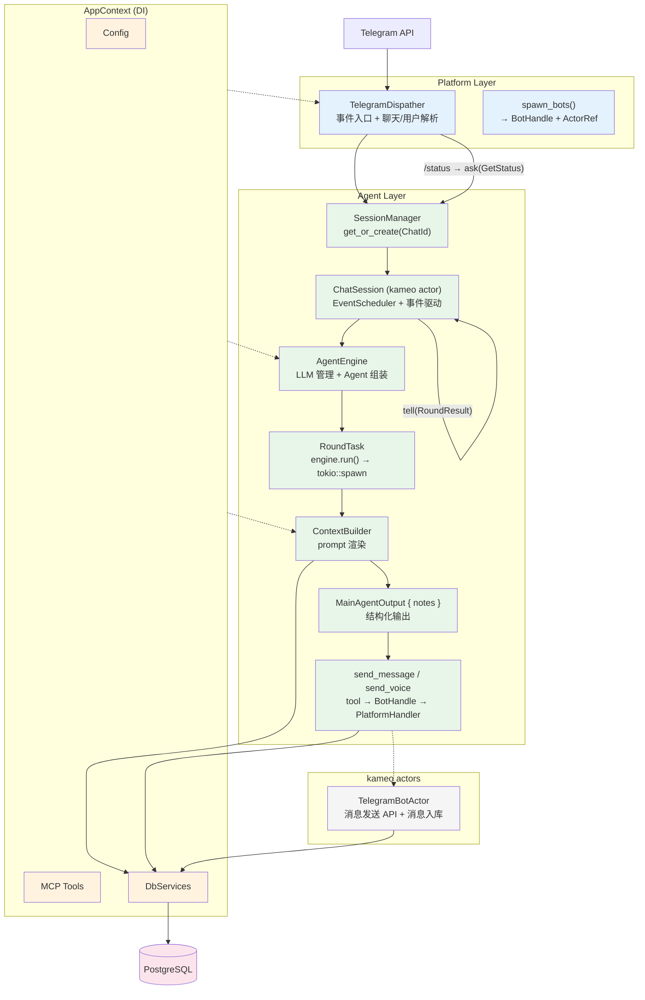

# hai 架构


```mermaid
graph TB
  TG["Telegram API"]

  subgraph Platform["Platform Layer"]
    DP["TelegramDispather<br/>事件入口 + 聊天/用户解析"]
    BM["spawn_bots()<br/>→ BotHandle + ActorRef<TelegramBotActor>"]
  end

  subgraph Agent["Agent Layer"]
    SM["SessionManager<br/>get_or_create(ChatId)"]
    CS["ChatSession (kameo actor)<br/>EventScheduler + 事件驱动"]
    EN["AgentEngine<br/>LLM 管理 + Agent 组装"]
    RT["RoundTask<br/>engine.run() → tokio::spawn"]
    CTX["ContextBuilder<br/>prompt 渲染"]
    AG["MainAgentOutput { notes }<br/>结构化输出"]
    SEND["send_message / send_voice<br/>tool → BotHandle → PlatformHandler"]
  end

  subgraph App["AppContext (DI)"]
    CFG["Config"]
    MCP["MCP Tools"]
    DB["DbServices"]
  end

  subgraph Actors["kameo actors"]
    BA["TelegramBotActor<br/>消息发送 API + 消息入库"]
  end

  PG[("PostgreSQL")]

  TG --> DP
  DP --> SM --> CS
  CS --> EN --> RT
  RT --> CTX --> AG
  AG --> SEND
  SEND -.-> BA

  CS -- tell(RoundResult) --> CS

  DP -- "/status → ask(GetStatus)" --> SM

  App -.-> DP
  App -.-> EN
  App -.-> CTX

  CTX --> DB
  SEND --> DB
  DB --> PG
  BA --> DB

  classDef infra fill:#f5f5f5
  classDef platform fill:#e3f2fd
  classDef agent fill:#e8f5e9
  classDef app fill:#fff3e0
  classDef store fill:#fce4ec

  class DP,BM platform
  class SM,CS,EN,RT,CTX,AG,SEND agent
  class CFG,MCP,DB app
  class PG store
  class BA infra
```

## 核心抽象

| 类型 | 职责 | 通信方式 |
|------|------|---------|
| `ChatSession` | 单 chat 事件调度 + round 生命周期 | kameo actor: `tell(WakeEvent)`, `ask(GetStatus)`, `tell(RoundResult)` |
| `TelegramBotActor` | 消息发送 + 入库 | kameo actor: `ask(SendMessageReq)`, `tell(TypingMsg)` |
| `AgentEngine` | LLM 管理 + Agent 组装 + `SessionManager` | `Arc` 共享 |
| `BotHandle` | 包装 `Arc<dyn PlatformHandler>`，工具通过它调平台 | 直接 `async fn` |
| `SessionManager` | 集中管理 ChatSession，`get_or_create(ChatId, spawn_fn)` | 内部 `RwLock<HashMap<ChatId, ActorRef>>` |
| `RoundTask` | 一轮 LLM 执行，完成后 `tell(RoundResult)` | `tokio::spawn` |
| `EventScheduler` | batch + heat + window | ChatSession 内部状态机 |
| `MainAgentOutput` | 结构化输出 `{ notes: Option<String> }` | autoagents `#[derive(AgentOutput)]` |

## 信号流

```
Telegram → TelegramDispather
  → engine.sessions.get_or_create(chat_id)
  → ChatSession.tell(WakeEvent)
  → scheduler.push() + try_consume()
  → RoundTask::spawn()
  → engine.run() → MainAgentOutput { notes }
  → tell(RoundResult) → ChatSession (下轮 context 用)
```

```
agent 工具调用:
  send_message tool → BotHandle.send_message()
  → TelegramPlatformHandler → bot_actor.ask(SendMessageReq)
  → resolve_platform_chat_id() → teloxide bot.send_message()
```

```
内部命令（/help /status /start）:
  dispatcher → self.bot.send_message()
  不经 actor，不经过 agent 系统
```

## 调度策略

`scheduler.rs` 中的 `impl WakeReason` 块：

| 策略 | 条件 | 效果 |
|------|------|------|
| `is_addressed` | `Direct` / `Mention` | 刷新注意力窗口 + 热量重置 |
| `is_rapid` | `Scheduled` / `Command` | 绕过 batch deadline |
| `is_mergeable` | `Observe` / `Mention` / `Direct` | 同类事件可合并 |

## ChatId 边界

`domain/vo/chat_id.rs` 定义 `ChatId(pub i64)`，和平台侧 chat ID 类型不同：

- agent 层内部传递全用 `ChatId`
- DB 层（repo/service）保持 `i64`，边界处 `.0` 取出
- dispatcher 入口处 `msg.chat.id.0` 不能直接传（编译不通过），强迫显式转换

## Context 渲染顺序

首轮（`build_first_round_prompt`）：
```
<situation> → <environment> → <chat> → <accounts>
→ <related_memories> → <related_topics> → <current_topics>
→ <scratchpad> → <perceptions> → <conversation>
```

后续轮次（`build_next_round_prompt`）：
```
<update>
  <last-round> → <toolcalls> → <internal><notes>
  <current_time> → <situation> → <messages>
```

## System Prompt 叠加

`SYSTEM_PROMPT`（自包含，含工具手册）→ `personality_context()` → config `system_prompt` → `private_prompt`/`group_prompt` → skills

## Bot 配置

```toml
[bot.main]
type = "telegram"
bot-token = "xxx"
allowed-chat-ids = [123456]

[bot.dev]
bot-token = "yyy"        # 省略 type，从 key 名推断
allowed-chat-ids = []
```

## 层次依赖

`entity → vo → repo → service → agent → app`，`infra` 不依赖上层。`platform` 依赖 `app`，不依赖 `agent`。
