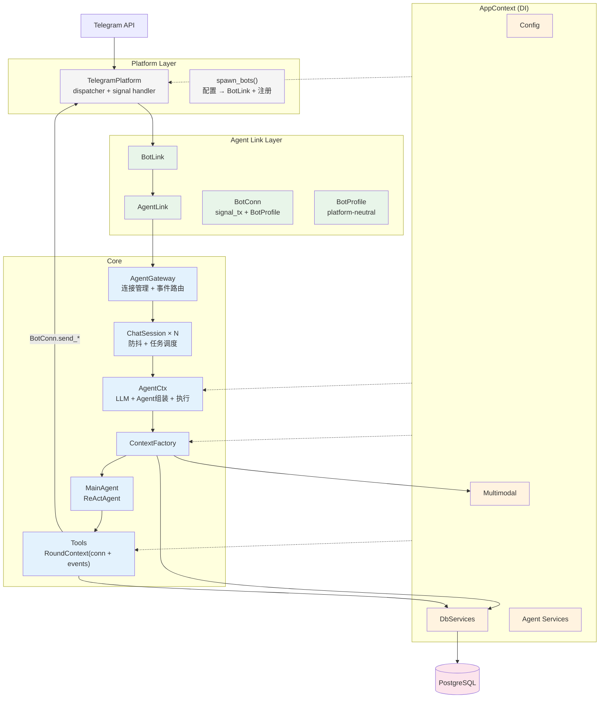

# hai 架构


```mermaid
graph TB
  TG["Telegram API"]

  subgraph Platform["Platform Layer"]
    TP["TelegramPlatform<br/>dispatcher + signal handler"]
    BM["spawn_bots()<br/>配置 → BotLink + 注册"]
  end

  subgraph Core["Core"]
    AH["AgentGateway<br/>连接管理 + 事件路由"]
    ACS["ChatSession × N<br/>防抖 + 任务调度"]
    AC["AgentCtx<br/>LLM + Agent组装 + 执行"]
    CF["ContextFactory"]
    AGENT["MainAgent<br/>ReActAgent"]
    TOOLS["Tools<br/>RoundContext(conn + events)"]
  end

  subgraph Identity["Agent Link Layer"]
    BL["BotLink"]
    AL["AgentLink"]
    BC["BotConn<br/>signal_tx + BotProfile"]
    BP["BotProfile<br/>platform-neutral"]
  end

  subgraph App["AppContext (DI)"]
    CFG["Config"]
    MULTI["Multimodal"]
    DB_SVC["DbServices"]
    AGT_SVC["Agent Services"]
  end

  PG[("PostgreSQL")]

  TG --> TP
  TP --> BL --> AL --> AH
  AH --> ACS
  ACS --> AC --> CF --> AGENT
  AGENT --> TOOLS
  TOOLS -- BotConn.send_* --> TP

  App -.-> TP
  App -.-> AC
  App -.-> CF
  App -.-> TOOLS

  CF --> DB_SVC
  CF --> MULTI
  TOOLS --> DB_SVC
  DB_SVC --> PG

  classDef infra fill:#f5f5f5
  classDef core fill:#e3f2fd
  classDef link fill:#e8f5e9
  classDef app fill:#fff3e0
  classDef store fill:#fce4ec

  class TP,BM infra
  class AH,ACS,AC,CF,AGENT,TOOLS core
  class BL,AL,BC,BP link
  class CFG,MULTI,DB_SVC,AGT_SVC app
  class PG store
```

## 信号流

```
Telegram → TelegramPlatform → BotLink.event_tx → AgentGateway → ChatSession
  → AgentCtx.execute(RoundContext) → ContextFactory → MainAgent → RoundContext
  → BotConn.send_message() → TelegramPlatform.handle_signal() → Telegram API
```

路由由连接隐式承载：`BotConn` 的 `signal_tx` 只发回创建它时的那个 `BotLink`。

## 核心抽象

| 层 | 类型 | 职责 |
|----|------|------|
| 连接 | `BotLink` / `AgentLink` | 一对 channel，bot ↔ agent 通信 |
| 连接 | `BotConn` | 封装 signal_tx + BotProfile，工具通过它发信号 |
| 连接 | `BotProfile` | 平台无关的身份信息 |
| 路由 | `AgentGateway` | 多 bot 连接注册、事件合并 → session |
| 执行 | `AgentCtx` | LLM / Agent 组装 / 任务执行（Arc 共享） |
| 会话 | `ChatSession` | 单 chat 防抖 + 任务调度 |
| 轮次 | `RoundContext` | 单次 agent 触发上下文（chat_id + conn + events） |
| 平台 | `TelegramPlatform` | Telegram 适配器（持有自己的 Bot + BotLink） |

## Context 渲染顺序

`<situation>` → `<environment>` → `<chat>` → `<accounts>` → `<related_memories>` → `<related_topics>` → `<current_topics>` → `<scratchpad>` → `<perceptions>` → `<conversation>`

## System Prompt 叠加

`personality_context()` → scene → `TOOL_MANUAL` → user `system_prompt` → Skills

## Bot 配置

```toml
[bot.main]
type = "telegram"
bot-token = "xxx"
allowed-chat-ids = [123456]

[bot.dev]
bot-token = "yyy"        # 省略 type，从 key 名推断
allowed-chat-ids = []
```

未指定 `type` 时从 key 名推断（`telegram` / `tg` → Telegram）。

## 层次依赖

`entity → vo → repo → service → agent → app`，`infra` 不依赖上层。`bot` 依赖 `app`，不依赖 `agent`。
