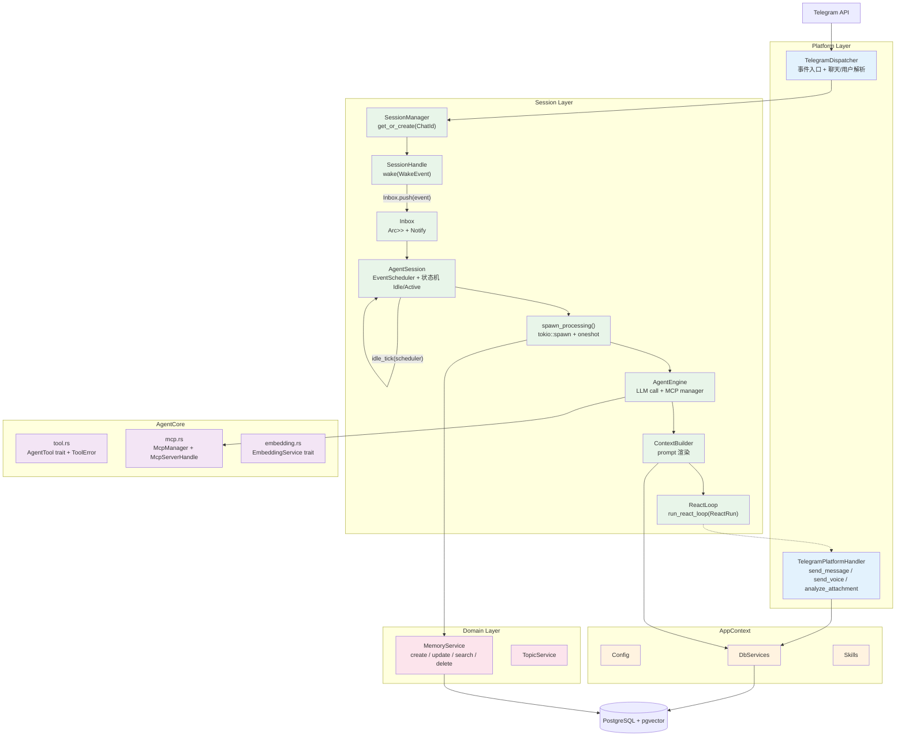

# hai 架构


```mermaid
graph TB
  TG["Telegram API"]

  subgraph Platform["Platform Layer"]
    DP["TelegramDispatcher<br/>事件入口 + 聊天/用户解析"]
    TH["TelegramPlatformHandler<br/>send_message / send_voice / analyze_attachment"]
  end

  subgraph Session["Session Layer"]
    SM["SessionManager<br/>get_or_create(ChatId)"]
    SH["SessionHandle<br/>wake(WakeEvent)"]
    SL["AgentSession<br/>EventScheduler + 状态机 Idle/Active"]
    EB["Inbox<br/>Arc<Mutex<Vec<WakeEvent>>> + Notify"]
    SP["spawn_processing()<br/>tokio::spawn + oneshot"]
    EN["AgentEngine<br/>LLM call + MCP manager"]
    CX["ContextBuilder<br/>prompt 渲染"]
    RL["ReactLoop<br/>run_react_loop(ReactRun)"]
  end

  subgraph Core["AgentCore"]
    TL["tool.rs<br/>AgentTool trait + ToolError"]
    MC["mcp.rs<br/>McpManager + McpServerHandle"]
    EM["embedding.rs<br/>EmbeddingService trait"]
  end

  subgraph App["AppContext"]
    CFG["Config"]
    SRV["DbServices"]
    SK["Skills"]
  end

  subgraph Domain["Domain Layer"]
    MS["MemoryService<br/>create / update / search / delete"]
    TS["TopicService"]
  end

  PG[("PostgreSQL + pgvector")]

  TG --> DP
  DP --> SM --> SH
  SH -- Inbox.push(event) --> EB
  EB --> SL
  SL --> SP --> EN
  EN --> CX --> RL
  EN --> MC
  RL -.-> TH

  SL -- idle_tick(scheduler) --> SL
  SP --> MS
  MS --> PG
  TH --> SRV
  CX --> SRV
  SRV --> PG

  classDef platform fill:#e3f2fd
  classDef session fill:#e8f5e9
  classDef core fill:#f3e5f5
  classDef app fill:#fff3e0
  classDef domain fill:#fce4ec

  class DP,TH platform
  class SM,SH,SL,EB,SP,EN,CX,RL session
  class TL,MC,EM core
  class CFG,SRV,SK app
  class MS,TS domain
```

## 核心抽象

| 类型 | 职责 | 通信方式 |
|------|------|---------|
| `Inbox` | 事件缓冲区 + 异步通知 | `Arc<Mutex<Vec>>` + `Notify` |
| `SessionManager` | `get_or_create(ChatId)` → `SessionHandle` | `Arc<RwLock<HashMap>>` + lazy retain |
| `SessionHandle` | wake/status 操作的 proxy | `Inbox` + `mpsc` |
| `AgentSession` | 单 chat 事件调度 + 状态机 | `idle_tick` / `await_completion` + `select!` |
| `ActiveProcessing` | 一轮 in-flight 的 `JoinHandle` + `oneshot::Receiver` | `await_completion()` → `ProcessingOutcome` |
| `EventScheduler` | debounce + heat + window 时机决策 | `enqueue()` + `decide()` |
| `AgentEngine` | LLM 调用 + MCP 管理 | `Arc` 共享 |
| `McpManager` | 启动/管理 MCP server 连接 | `rmcp` 库 |
| `BotHandle` | 包装 `Arc<dyn PlatformHandler>` | 直接 `async fn` |
| `RunContext` | 一轮 processing 的完整执行上下文 | 纯数据 |
| `ReactRun` | `run_react_loop` 的捆绑参数 | `Client + Messages + Config + Inbox + AgentEventBus` |

## 信号流

```
Platform → TelegramDispatcher
  → SessionManager.get_or_create(chat_id)
  → SessionHandle.wake(WakeEvent)
  → Inbox.push()
    → idle_tick (drain → scheduler.enqueue → scheduler.decide)
      → dispatch(events)
        → assemble_run (build_run_context + gather_messages + next_prompt)
        → spawn_processing → run_react_loop(ReactRun, tools)
      → on_complete → Idle

agent 工具调用:
  send_message tool → BotHandle.send_message()
  → TelegramPlatformHandler → resolve_platform_chat_id()
  → teloxide bot.send_message()

内部命令（/help /status /start）:
  dispatcher → self.bot.send_message()
  不经 agent 系统
```

## Session 生命周期

- `SessionManager` 在 `agent/runtime/registry.rs`，管理所有 `AgentSession` 的创建与清理
- `get_or_create(ChatId)` → 读锁快速查找，写锁 double-check 后插入
- session task 退出时 `JoinHandle.is_finished()` → lazy retain 自动移除
- Session 退出后如果同 chat 又来消息，在 `get_or_create` 创建新 session
- 所有 session 共用 `AgentEngine`（LLM client + MCP + skills），通过 `Arc` 共享

## 事件流设计

两个关键事件消费路径：

**Idle 路径**：`Inbox.drain()` → `scheduler.enqueue()` → `scheduler.decide()` → `dispatch(events)`
  - 事件存入 `scheduler.queue`，debounce/window 时机成熟才 dispatch
  - Defer → 继续等待；Done → session 退出

**Active 路径**：Processing 结束后 `on_complete` / Failed / Cancelled
  - `inbox.drain()` → `scheduler.enqueue()` → `state = Idle`
  - 下一轮循环进 `idle_tick`，走正常 `scheduler.decide()` 调度

## 层叠结构

```
error/ util/         基元层（无内部依赖）
  util/pgvector.rs     pgvector 搜索/写入封装
agentcore/           基础设施层（只依赖 error/config）
  tool.rs              AgentTool trait + ToolError + 辅助函数
  mcp.rs               McpManager（基于 rmcp SDK）
  embedding.rs         EmbeddingService trait
  provider.rs          genai Client 工厂
  render/              XML/JSON/MD 渲染
  skills/              SkillManager
domain/              领域层（数据模型 + 业务逻辑）
  model/               toasty 模型
  service/             业务逻辑，直接调 toasty + sqlx（pgvector 查询）
  vo/                  值对象
config/              配置系统
agent/               业务逻辑层
  node/               agent 节点定义
  runtime/            AgentEngine + AgentSession + ReactLoop
  context/            提示词渲染
  tools/              工具实现（每个模块一个工厂函数）
platform/            平台集成
  telegram/             teloxide 路由 + 消息处理
app/                 应用上下文 + 启动
```

## Memory 系统

所有记忆统一存入 `Memory` 表，`kind` 列区分类型：

```rust
enum MemoryKind { UserFact, Note, Knowledge }

struct Memory {
    id: Uuid,
    chat_id: Option<i64>,
    account_id: Option<i64>,   // UserFact 专用
    content: String,
    importance: i32,
    kind: String,               // "user_fact" | "note" | "knowledge"
    meta: Option<Json>,        // 通用元数据（references 等）
    created_at: Timestamp,
    updated_at: Timestamp,
}
```

- 所有类型都嵌入（无条件），不做 type 排除
- `MemoryService::create(kind, ...)` 统一入口，取代旧的 `MemoryInput` 枚举
- `MemoryService::update(id, content?, importance?)` 统一更新
- `MemoryService::search_related()` 搜索所有类型，无过滤

## Tools 层

所有工具实现 `agentcore::tool::AgentTool` trait：

```rust
#[async_trait]
pub trait AgentTool: Send + Sync {
    fn name(&self) -> &str;
    fn description(&self) -> &str;
    fn schema(&self) -> Value;
    async fn execute(&self, args: Value) -> Result<Value, ToolError>;
}
```

两种实现方式：
1. **`#[hai_macros::tool]` 宏** — 零样板。`name` 从 struct 名推导，`description` 从 doc comment 取，`schema` 从 `schemars::schema_for!` 自动生成，`execute` 反序列化后调用 `self.exec(typed)`。
2. **手动 `impl AgentTool`**（RunShell / AnalyzeAttachment）— 因 `description()` 需要运行时拼接。

MCP 工具通过 `McpServerHandle` 包装 `rmcp::model::Tool` 为 `AgentTool`。

## Embedding

`domain/service/` 通过 `Arc<dyn EmbeddingService>` 注入。`MultimodalService` 实现该 trait。

向量存储在 `embedding vector(N)` 列中，由 `pgvector` 管理。toasty model 不感知此列，完全由 `sqlx` 读写。

- `util::pgvector::search_embedding_vec()` — `SELECT ... ORDER BY embedding <-> $1::vector LIMIT $k`
- `util::pgvector::upsert_embedding_vec() / clear_embedding_vec()` — 业务写路径
- `rebuild` CLI 自动 `ALTER COLUMN TYPE vector(N)` + 填充 + 建 IVFFlat 索引
- 维度 `N` 从 `[multimodal.embedding.dimension]` 读取，换模型时重跑 rebuild

```
搜索流程:
  pgvector search_embedding_vec → Vec<(Uuid, f64)>  // (id, distance)
  toasty in_list → Vec<Memory>                       // 完整 ORM 对象
  Rust map → Vec<RelatedMemory>                      // 领域 VO
```

## Context 渲染顺序

首轮（`build_first_run_prompt`）：
```
<situation> → <chat> → <accounts> → <related_memories>
→ <related_topics> → <current_topics> → <scratchpad>
→ <perceptions> → <conversation>
```

后续轮次（`build_next_run_prompt`）：
```
<update>
  <last-round> → <toolcalls> → <notes>
  <current_time> → <situation> → <messages>
```

## 调度策略

`scheduler.rs`（pure timing engine）：

| 方法 | 触发条件 | 效果 |
|------|----------|------|
| `is_addressed` | Direct / Mention | 刷新窗口 + 热量 |
| `is_rapid` | Scheduled / Command | 绕过 debounce |
| `is_mergeable` | Observe / Mention / Direct | 同类事件可合并 |
| debounce 0.5s | 最后一次事件后等 500ms | 到达 deadline 才 dispatch |
| Heat spend | `random < heat.value` | 概率性 dispatch（Observe） |

## Bot 配置

```toml
[bot.telegram]
bot-token = "xxx"
allowed-chat-ids = [123456]
```

Config 覆盖链：`.hai/config.toml` → `HAI_` 环境变量 → 运行时热加载。
`HAI_LOCAL_MODE=1` 强制使用 `.hai/`，否则回退 `$XDG_CONFIG_HOME/hai/`。

## Provider

- `api_key: Option<String>` — Ollama 等本地服务可省略
- 已知 backend 需显式注册 `[providers.*]`
