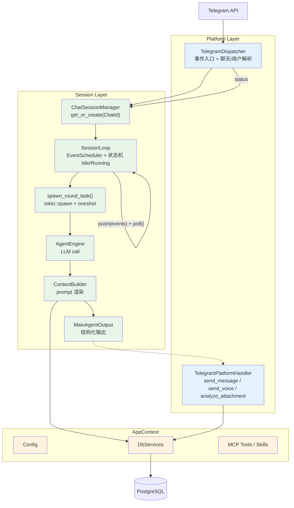

# hai 架构


```mermaid
graph TB
  TG["Telegram API"]

  subgraph Platform["Platform Layer"]
    DP["TelegramDispatcher<br/>事件入口 + 聊天/用户解析"]
    TH["TelegramPlatformHandler<br/>send_message / send_voice / analyze_attachment"]
  end

  subgraph Session["Session Layer"]
    SM["ChatSessionManager<br/>get_or_create(ChatId)"]
    SL["SessionLoop<br/>EventScheduler + 状态机 Idle/Running"]
    RN["spawn_round_task()<br/>tokio::spawn + oneshot"]
    EN["AgentEngine<br/>LLM call"]
    CTX["ContextBuilder<br/>prompt 渲染"]
    AG["MainAgentOutput<br/>结构化输出"]
  end

  subgraph App["AppContext"]
    CFG["Config"]
    SRV["DbServices"]
    MC["MCP Tools / Skills"]
  end

  PG[("PostgreSQL")]

  TG --> DP
  DP --> SM --> SL
  SL --> RN --> EN
  EN --> CTX --> AG
  AG -.-> TH

  SL -- push(events) + poll() --> SL

  DP -- status --> SM

  CTX --> SRV
  TH --> SRV
  SRV --> PG

  classDef platform fill:#e3f2fd
  classDef session fill:#e8f5e9
  classDef app fill:#fff3e0

  class DP,TH platform
  class SM,SL,RN,EN,CTX,AG session
  class CFG,SRV,MC app
```

## 核心抽象

| 类型 | 职责 | 通信方式 |
|------|------|---------|
| `ChatSessionManager` | `get_or_create(ChatId)` → `ChatSessionHandle` | tokio `RwLock<HashMap>` |
| `ChatSessionHandle` | wake/status 操作的 proxy | tokio `mpsc::UnboundedSender` × 2 |
| `SessionLoop` | 单 chat 事件调度 + round 状态机 | `select!` 轮询 wake/status/result |
| `RunningRound` | 一轮 in-flight 的 `JoinHandle` + `oneshot::Receiver` | `poll()` → `RunningOutcome` |
| `EventScheduler` | batch + heat + window + debounce 0.5s | `push()` + `poll()` + `next_deadline()` |
| `AgentEngine` | LLM 调用 + Agent 组装 | `Arc` 共享 |
| `BotHandle` | 包装 `Arc<dyn PlatformHandler>` | 直接 `async fn` |
| `RoundContext` | 一轮 task 的完整执行上下文（prompt + tools + db） | 纯数据 |

## 信号流

```
Telegram → TelegramDispatcher
  → registry.get_or_create(chat_id)
  → ChatSessionHandle.wake(WakeEvent)
  → scheduler.push() + poll()
  → dispatch_with()
    → assemble_round()  (build_round_context + gather_messages + build_prompt)
    → spawn_round_task() → engine.run() → Round
  → on_round_complete() → rounds.push + schedule.refresh
```

```
agent 工具调用:
  send_message tool → BotHandle.send_message()
  → TelegramPlatformHandler → resolve_platform_chat_id()
  → teloxide bot.send_message()
```

```
内部命令（/help /status /start）:
  dispatcher → self.bot.send_message()
  不经 agent 系统
```

## ChatId 安全边界

`domain/vo/id.rs` 定义具体 newtype（`ChatId`, `MessageId` 等），模型字段用裸 `i64`/`Uuid` 保持 ORM 兼容。

- 服务层签名用 `ChatId` → 编译期防止和 `i64` 混淆
- 边界处 `.0` 解开传递给 toasty
- dispatcher 入口处 `msg.chat.id`（teloxide 类型）不可隐式转换

## Context 渲染顺序

首轮（`build_first_round_prompt`）：
```
<situation> → <chat> → <accounts> → <related_memories>
→ <related_topics> → <current_topics> → <scratchpad>
→ <perceptions> → <conversation>
```

后续轮次（`build_next_round_prompt`）：
```
<update>
  <last-round> → <toolcalls> → <notes>
  <current_time> → <situation> → <messages>
```

## 调度策略

`scheduler.rs`：

| 方法 | 触发条件 | 效果 |
|------|----------|------|
| `is_addressed` | Direct / Mention | 刷新窗口 + 热量 |
| `is_rapid` | Scheduled / Command | 绕过 batch deadline |
| `is_mergeable` | Observe / Mention / Direct | 同类事件合并 |
| debounce | 最后一次事件后 500ms | 到达 deadline 才 dispatch |
| guard window | 3s | 新 addressed 事件打断当前 round |

## Bot 配置

```toml
[bot.telegram]
bot-token = "xxx"
allowed-chat-ids = [123456]
```

省略 `type` 从 key 名推断。Config 覆盖链：`.hai/config.toml` → `HAI_` 环境变量。

## Provider

- `api_key: Option<String>` — Ollama 等本地服务可省略
- 已知 backend 需显式注册 `[providers.*]`
- Requesty 路由：`openai/gpt-4o`、`vertex/gemini-3.1-flash-lite`
