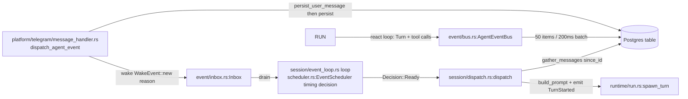

# architecture

> Cross-package dependencies, layering constraints, event system, assembly root, and underlying infrastructure. Must read when changes touch cross-module wiring, dependency direction, or event persistence.

## Architecture declaration

Top-down layering chain `app → platform → agent → agentcore + config + domain` (also includes the `util / error / infra` underlying layers), with dependencies pointed downward only (DDD dependency direction); agentcore is a core library with zero agent/domain dependencies, config is a pure data layer, and domain is a data layer; platform details are kept out of the agent layer by two traits. Altogether this conforms to the philosophy (single-direction layering + type-driven). Two known dependency violations are listed below; no new violations of the same kind are allowed.

### Layering & dependency direction (measured)

```txt
app → platform → agent → agentcore + domain + config
                     ↘  domain → agentcore(embedding trait) + util + sqlx
agentcore → config (mcp.rs reads McpConfig — known one-way violation, not a cycle, see below)
util → agentcore (pgvector.rs → embedding::EmbeddingService)
error.rs has no internal deps (only thiserror/strum)
```

- **`agentcore/` has zero `crate::agent` / `crate::domain` references** (verified by grep) — hard rule satisfied
- **Known violation 1 (domain reverse direction)**: `domain/service/mod.rs` depends on `agent::multimodal::MultimodalService` (injected into `DbServices` as `Arc<dyn EmbeddingService>`). See "Evolution direction" for the refactor direction. **No new violations of the same kind allowed**
- **Known violation 2 (agentcore → config, one-way)**: only `agentcore/mcp.rs:connect` reads `config::schema::McpConfig` — the original agentcore↔config cycle has been broken (config→agentcore references cleared), but the remaining one-way dependency still violates the "agentcore zero dependency" principle; `ProviderKind` is now in agentcore/provider.rs, `ProviderEntry` is in config/provider_manager.rs (they do not reference each other). Must be handled before splitting the crate.
- Platform details are entirely kept out of the agent layer by two traits: `agent/link.rs:PlatformHandler` (platform operations) + `agent/context/types.rs:ContentParser` (content parsing, implemented by the platform and injected via `handler.content_parser()`) — the tools layer has zero concrete platform imports

## Key data flows

### Event system chain (Platform → wake → Inbox → EventScheduler → dispatch → spawn_turn)


```mermaid
flowchart LR
    TELE[platform/telegram/message_handler.rs<br/>dispatch_agent_event] -->|persist_user_message then persist| DB[(Postgres table)]
    TELE -->|wake WakeEvent::new reason| INBOX[event/inbox.rs:Inbox]
    INBOX -->|drain| LOOP[session/event_loop.rs loop<br/>scheduler.rs:EventScheduler timing decision]
    LOOP -->|Decision::Ready| DISPATCH[session/dispatch.rs:dispatch]
    DISPATCH -->|gather_messages since_id| DB
    DISPATCH -->|build_prompt + emit TurnStarted| TURN[runtime/run.rs:spawn_turn]
    RUN -->|react loop: Turn + tool calls| BUS[event/bus.rs:AgentEventBus]
    BUS -->|50 items / 200ms batch| DB
```

1. Platform messages are **persisted before being woken**: `dispatch_agent_event` first calls `persist_user_message` (topics/platform.md "persist before wake"), then calls `session.wake(WakeEvent::new(reason))` — WakeEvent only carries a reason and is a pure notification; messages are always pulled from the DB by dispatch's `gather_messages(since_id)`
2. `event/inbox.rs:Inbox` is a cross-thread input queue (`Arc<Mutex<Vec<WakeEvent>>>` + `tokio::sync::Notify`), `push` wakes the session loop
3. `session/scheduler.rs:EventScheduler` only performs **timing decisions**: debounce 1.5s + Heat/Window probabilistic attention (`attention.rs`: base 0.05, spend 0.25, reset 1.0; no decay within the 30s active window after being @'d/replied) + `last_activity` independent idle timer (**only addressed events/speech refresh it, Observe does not refresh** — a pure Observe session counts idle from its creation time and can expire normally, see topics/session.md) → `Decision::{Ready, Defer, Done}`
4. `dispatch.rs:dispatch`: build_turn_context → gather_messages → build_prompt → **stage_shown (staged retrieval injection)** → emit `TurnStarted` → `runtime.spawn_turn` (state switches to Busy, holds JoinHandle + oneshot result_rx)
5. Turn is a react loop (`react.rs:run_react_loop`, multiple Steps + tool calls), each turn's events are persisted via `AgentEventBus`; loop termination semantics: Main mode ends on empty text + skip/no activity call, wrap-up mode stops when there are no tool calls; **Turn has three states** (Success / Steered / Failed, see topics/session.md): Success/Steered ends normally → `on_complete` advances (cursor/shown staging commit, ContextMeta update); Failed has zero state side effects (staging discarded, stays Idle waiting for the next message)
6. `on_complete` (BusySignal::Turn/WrapUp) → conversation.update (**ContextMeta update: tokens/turn_count only advance on success; turn_count is chapter-level — reset on reopen**) → back to Idle → continue the loop; Turn/wrap-up failure stays Idle (does not exit); after idle expires the `should_wrap_up` determination decides between reopen or Exit (chapter reopen mechanism, see topics/session.md)

### Event definition & persistence

- The enum is **defined in `domain/vo/event.rs`**: `AgentEventPayload` (`#[serde(tag = "event", rename_all = "kebab-case")]`, 9 variants), `AgentEvent{chat_id, payload}` + `to_json_value()` (serialization failure → Null + warn) — see that file for the variant list; here we only record the semantics that cannot be read from the code
- `agent/runtime/event/bus.rs:AgentEventBus`: re-exports the enum; `emit` → unbounded channel → collector persists to DB in batches (`FLUSH_BATCH=50` items or `FLUSH_INTERVAL=200ms`) into the `event` table (`domain="agent"` constant value)
- Event table structure: `seq` (I64 auto PK) / `domain` (Text) / `payload` (JSONB) / `created_at` — **no standalone chat_id/kind column**, chat_id lives inside the payload JSON; JSONB filtering directly uses `payload->>'chat_id'` / `payload->'payload'->>'event'` (TEXT→JSONB migration already done, see topics/cli.md)

Variant semantics key points (behavior that cannot be read from code; check before changing the event structure):

- `StepCompleted` is emitted each Step; `TurnEnded.output` is the StepOutput of the last step
- `ModelRetry{ResponseWithText}` is **not a retry**: it injects `DIRECT_OUTPUT_ERROR` and continues the loop (react.rs); the only real retry is `TimeoutRetry` (Reqwest timeout/connect, at most 2 times, backoff 500ms×attempt)
- `WrapUpStarted` = the retention that starts before a chapter reopen; `WrapUpCompleted.turns_count` = the number of turns before wrap-up (after reopen `start_new_chapter` zeroes ContextMeta + clears shown ids, naturally preventing repeated wrap-ups); `WrapUpFailed{error}` = retention failure, a clean chapter is reopened after the event (topics/session.md)
- CLI/TUI event tag mapping: TURN/TOOL/STEP/DONE/RETRY/FAIL/STEER/WRAP (`cli/display.rs:tag_for_kind` + `KIND_TAGS`; WRAP covers wrap-up-started and wrap-up-completed — the storage layer only has the single turn-ended tag, FAIL/STEER are currently filtered and equivalent to DONE, see topics/cli.md pitfalls)

### Dual-client strategy

| Purpose | Client | Reason |
|---|---|---|
| Main conversation | genai `create_genai_client` (adapter system; AzureOpenAI/Phind/Requesty → OpenAI compatible) | Covers multi-provider adaptation |
| embedding / TTS / multimodal | self-developed `agentcore::ApiClient` (OpenAI-compatible REST: chat/completions, embeddings, audio/speech) | Covers tooling endpoints, controllable |

### Error handling system

Error shapes and conventions (`AppError{kind, message, source}` single type + `register_errors!` centralized From, `?` preferred / `let _` only for best-effort / `if let Err(e)` warn) see docs/topics/config.md "Error handling system"; the domain service "swallow-error pattern" see docs/topics/domain.md pitfalls (`ConversationRecordService::get` already fixed per contract).

## Module navigation

| Module | Key files | Responsibility |
|---|---|---|
| app/ | mod.rs, context.rs | Assembly root: log initialization → AppContext → AgentEngine → spawn_bots → ctrl_c |
| platform/ | manager.rs, telegram/ (11 files) | Platform integration: teloxide Dispatcher + PlatformHandler/ContentParser implementations |
| agent/ | runtime/, context/, tools/, multimodal/, node/, personality/ | Session/scheduling/run loop/context rendering/tool set/multimodal |
| agentcore/ | tool.rs, mcp.rs, provider.rs, apiclient.rs, embedding.rs, skills/, render/ | Core library: tool abstraction, MCP integration, provider client, skills, XML rendering (zero agent/domain dependencies) |
| domain/ | model/, repo/, service/, vo/, db.rs | Data layer: 13-table model + repo (sqlx) + service + event VO |
| config/ | schema.rs, manager.rs, provider_manager.rs, paths.rs, env.rs | Pure data config (Patch style) + file→env merge + provider resolution |
| cli/ | cli.rs, display.rs, tui/, kb.rs, log.rs | Command surface: config/db/log/kb subcommands + event log TUI |
| Underlying | error.rs, util/, infra/ | Single error type, pgvector/url/path utilities, FileCache |

## Evolution direction

- **Eliminate the agentcore → config one-way dependency**: `agentcore/mcp.rs` reads McpConfig — move the MCP config section down into agentcore or inject it via a trait, removing the last reference to config (the original agentcore↔config cycle was already broken when ProviderKind moved down into agentcore)
- **Fix known violation 1**: the `domain/service/mod.rs` → `agent::multimodal::MultimodalService` dependency — move MultimodalService down into agentcore or isolate it through the embedding trait
- **Startup scan interface**: chapter reopen does not do a startup-phase scan for "chats with no new messages after restart" (the spec leaves the interface open) — add a background scan component when needed (throttled to prevent startup storms)
- **Multi-platform extension**: PlatformHandler/ContentParser traits are already isolated, adding a new platform only requires implementing the two traits
